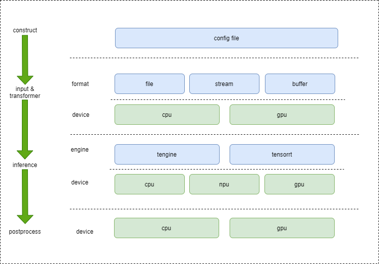

# TengineInferPipe

## 简介

**TengineInferPipe** 是由 OPEN AI LAB 基于[mediapipe](https://github.com/google/mediapipe)框架进行改进、迭代的一套低代码、模块化的算法落地框架。通过解析部署配置文件，构建整个部署流程。可以用于快速构建算法部署sdk，以及可以作为一些可视化部署方案的中间层。

## 架构简析

​	通过[mediapipe可视化工具](https://viz.mediapipe.dev/)可以直观的查看配置文件中的部署流程及数据流向

## 快速上手

### 编译

* 基于[Tengine](https://github.com/OAID/Tengine)的linux下[x86平台](./docs/compile_x86.md)以及[a311d平台](./docs/compile_a311d.md)
* 基于TensorRT的[Jetson平台](compile_jetson.md)

### 示例

* [examples](examples/) 提供基础的检测算法用例

## 致谢

TengineInferPipe参考项目：

- [Tengine](https://github.com/OAID/Tengine)
- [mediapipe](https://github.com/google/mediapipe)
- [TensorRT](https://github.com/NVIDIA/TensorRT)

## License

- [Apache 2.0](https://github.com/OAID/Tengine/blob/tengine-lite/LICENSE)

