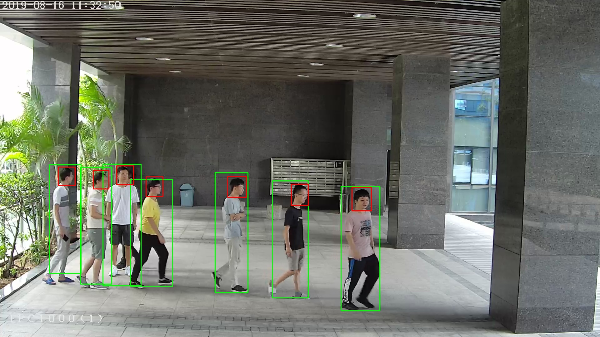

## example-a311d

#### 人体检测示例

> 使用cmake构建，调用SDK编译时生成的库文件和头文件

1. 复制所需的依赖项

   ```
   mkdir tengine
   cp -r <tengine-lite-root-dir>/3rdparty/tim-vx ./tengine/
   cp -r <tengine-lite-root-dir>/build/install/* ./tengine/
   mkdir include
   cp <inferpipe-root-dir>/mediapipe/interface/inferpipe_tengine.h ./include/
   mkdir libs
   cp <inferpipe-root-dir>/bazel-bin/mediapipe/examples/desktop/object_detection/libdesktop_tengine_calculators.so ./libs/
   ```

2. 编译工程

   ```
   mkdir build
   cd build
   cmake -DBUILD_ON_AARCH64=ON -DBUILD_ON_A311D=ON -DUSE_OPENCV4=ON ..
   make -j`nproc`
   ```

   得到demo_run_detect_main文件用于测试检测

3. 测试检测示例

   执行命令

    ```
   ./demo_run_detect_main ${构建计算流程的配置文件} ${计算流程输入节点的名称} ${计算流程输出节点的名称} ${测试视频路径}
    ```

   其中${计算流程输入节点的名称} ${计算流程输出节点的名称}两个值可以参考${构建计算流程的配置文件}中的`input_stream`

   例如

   * retinanet

   ```
   ./demo_run_detect_main ../object_detection_retina_a311d.pbtxt input_frame output_detect ../test.mp4
   ```

   * yolov5

   ```
   ./demo_run_detect_main ../object_detection_yolov5_a311d.pbtxt input_frame output_detect ../test.mp4
   ```

   程序默认保存每一帧的检测结果到当前目录

   

